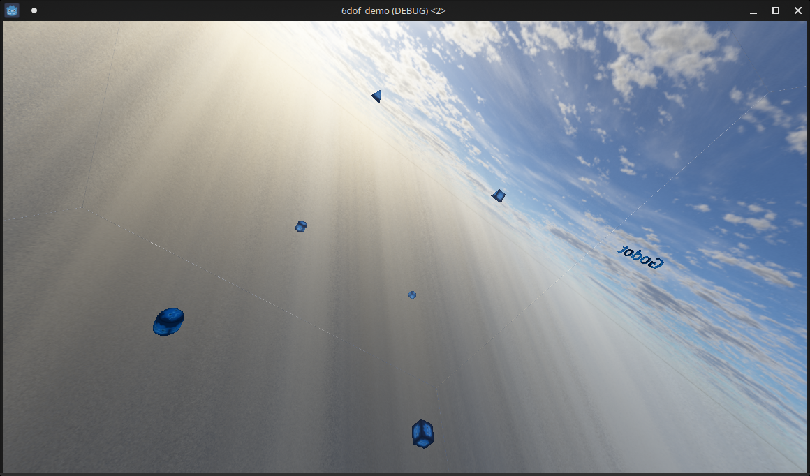

# 6DOF_Demo
6 Degrees of Freedom shooter Demo for the Godot Game Engine

This is a demonstration of how to implement a 6DOF character controller with networking on the Godot Game Engine.

You can rotate around all three axes and move in 6 directions(more if you combine keys).

Also includes a skybox.

